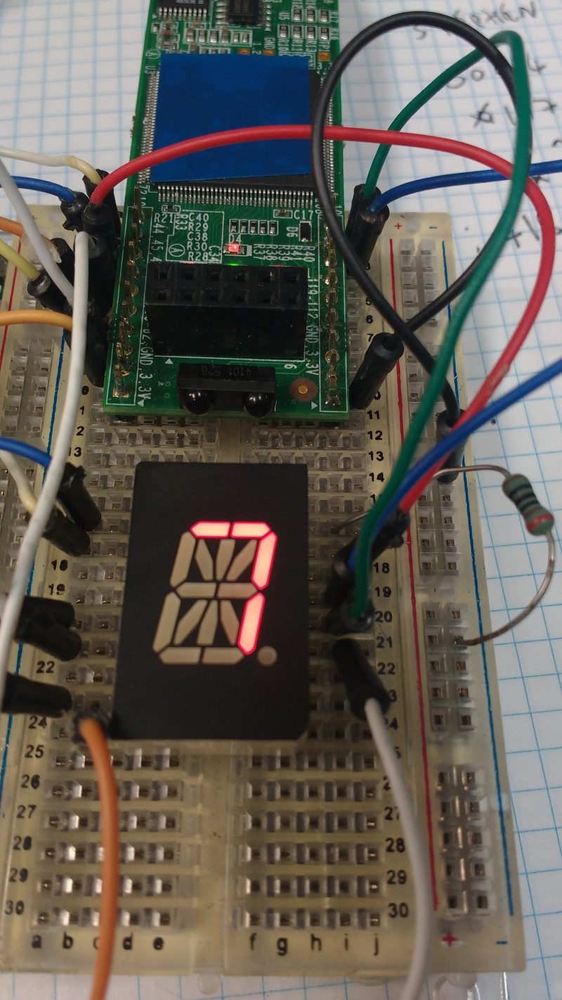
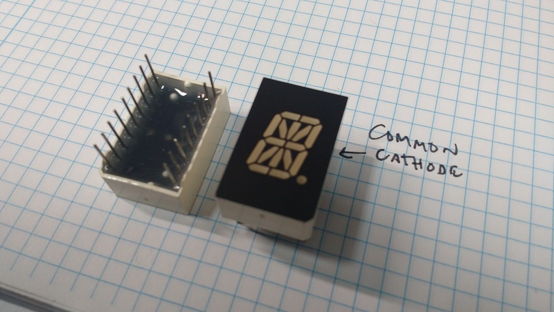

# 10 segment demo

uses 10 segments of a multi segment display to count 0->9

# wiring

segments are wired to each pin of the icestick as shown

    44   - -  45
    62  |   | 47
    119  - -  118
    61  |   | 48
    60   - -  56
    
photo shows the common cathode. I connected this to 0v via a 100R resistor and
drove the segments directly from the fpga.

[icestick pinout](http://www.pighixxx.net/portfolio-items/icestick/)
